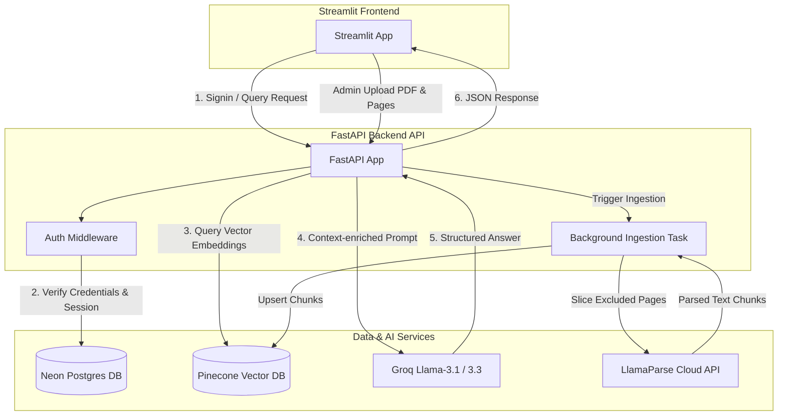

# 🎓 University UG Prospectus RAG Chatbot

An AI-powered Retrieval-Augmented Generation (RAG) assistant for querying University Undergraduate Prospectuses. Built with a secure **FastAPI backend** (using **Neon serverless Postgres** for role-based access control), a premium **Streamlit glassmorphism frontend**, and an asynchronous parallel ingestion pipeline leveraging **LlamaParse**, **Pinecone**, and **Groq LLMs**.

---

## 🏗️ System Architecture



---

## 📁 Directory Structure

```
workspace/
├── backend/
│   ├── __init__.py
│   ├── api.py           # FastAPI routes, auth middleware, and background workers
│   ├── database.py      # Neon Postgres connection & schema initializer
│   └── schemas.py       # Pydantic validation request/response objects
├── frontend/
│   ├── __init__.py
│   └── app.py           # Streamlit UI client with glassmorphism chat & Admin panels
├── core/
│   ├── __init__.py
│   ├── chatbot.py       # Core RAG querying engine (Groq model + Pinecone lookup)
│   ├── main.py          # Parallel page-by-page PDF extraction and index uploader
│   └── admin_process.py # PDF processing operations, layout splits & OCR fallbacks
├── static/
│   └── seat_distribution.pdf  # Extracted seat matrix pages (served to browser)
├── .env                 # API Keys and database configuration
├── requirements.txt     # Virtual environment dependencies
└── UGProspectus2025.pdf # Main prospectus source document
```

---

## 🛡️ User Types & Roles

The system supports two access levels configured dynamically:

| Role | Permissions | Available UI Panels |
| :--- | :--- | :--- |
| **USER** | Sign up, Log in, query RAG chatbot, download seat distribution PDF. | `💬 Chatbot Interface` |
| **ADMIN** | Sign up, Log in, query RAG chatbot, **create new Admin profiles**, **upload new prospectus PDF**, specify **excluded seat matrix page numbers** for ingestion. | `💬 Chatbot`, `📤 Ingest New Prospectus`, `🔑 Create New Admin` |

---

## ⚙️ Environment Configuration

Create a `.env` file in the root directory with the following variables:

```env
# Database Configuration (Neon PostgreSQL)
DATABASE_URL="postgresql://<user>:<password>@<neon_host>/<dbname>?sslmode=require"

# Vector Database (Pinecone)
PINECONE_API_KEY="your-pinecone-api-key"

# Ingestion Processing (Llama Cloud)
LLAMA_CLOUD_API_KEY="your-llama-cloud-api-key"

# LLM Inference API (Groq)
GROQ_API_KEY="your-groq-api-key"
```

---

## 🚀 Running the Application

Ensure you have activated your virtual environment before running the commands:

### 1. Start the FastAPI Backend
Start the backend server on port 8000. It will automatically connect to Neon Postgres, create the tables, and seed the default admin account:
```powershell
.\venv\Scripts\python.exe -m uvicorn backend.api:app --host 0.0.0.0 --port 8000 --reload
```

### 2. Start the Streamlit Frontend Client
Start the Streamlit interface on port 8501:
```powershell
.\venv\Scripts\streamlit.exe run frontend/app.py --server.port 8501
```

### 3. Log In (Default Admin Credentials)
Access the UI in your browser at **[http://localhost:8501](http://localhost:8501)** and authenticate with:
*   **Username**: `admin`
*   **Password**: `admin123`

---

## 🔌 API Documentation

| Method | Endpoint | Access | Description |
| :--- | :--- | :--- | :--- |
| **POST** | `/auth/signup` | Public | Register a new normal user account (`USER` role). |
| **POST** | `/auth/login` | Public | Validate credentials, create session, return token and role. |
| **POST** | `/admin/create-admin` | `ADMIN` Only | Create another user with `ADMIN` privileges. |
| **POST** | `/admin/upload-prospectus` | `ADMIN` Only | Upload a new prospectus, save locally, update page splits, and run background re-indexing. |
| **POST** | `/user/query` | Authenticated | Query RAG engine and retrieve structured answers from Pinecone index. |
